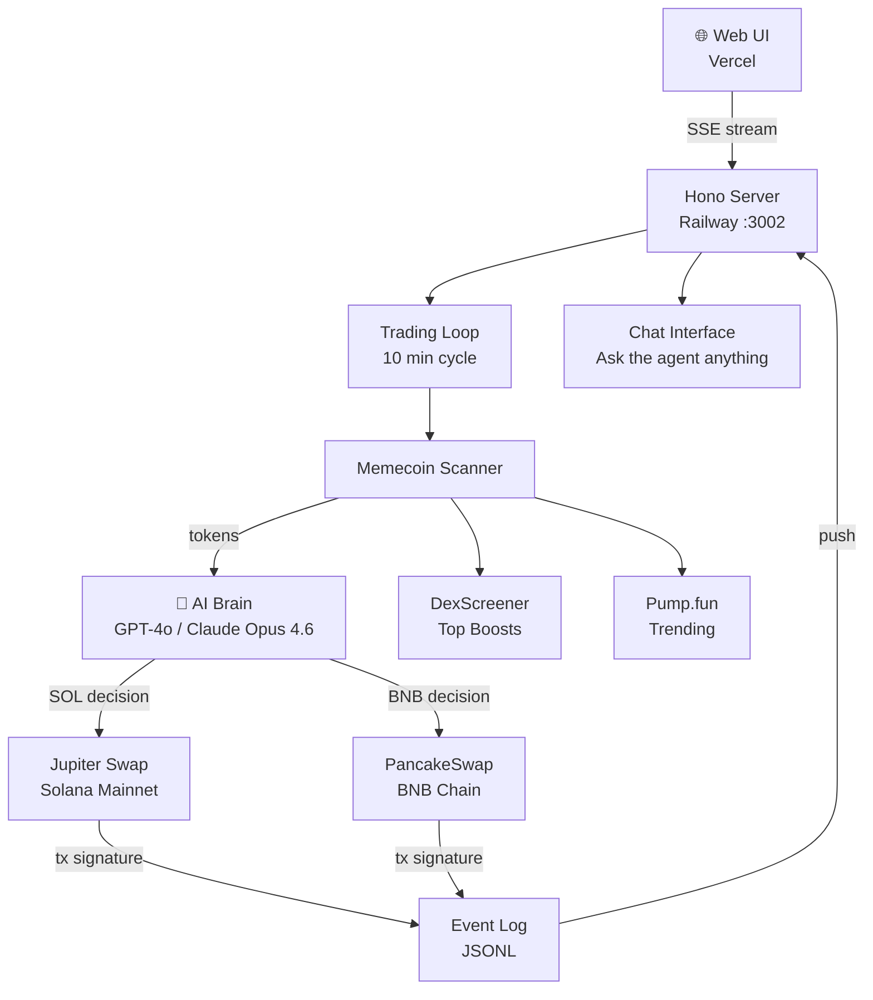

<div align="center">


# MILES TRADER

**Autonomous AI trading agent — BNB & SOL**

[](https://ui-zeta-roan.vercel.app)
[](https://actavis-agent-production.up.railway.app/health)
[](#)
[](#)
[](#)
[](#license)

> **MILES TRADER** runs 24/7 — scanning DexScreener & Pump.fun every 10 minutes,  
> reasoning through market data with GPT-4o / Claude Opus 4.6, and executing trades autonomously on BNB & SOL.

<br/>

[**→ Open Live Dashboard**](https://ui-zeta-roan.vercel.app) &nbsp;·&nbsp; [**→ Health Check**](https://actavis-agent-production.up.railway.app/health)

</div>

---

## What It Does

```
Every 10 minutes:

  📡 Scan  ──▶  DexScreener top boosts  +  Pump.fun trending
     │
  🧠 Think ──▶  GPT-4o / Claude Opus 4.6 analyzes price action, volume, liquidity, age
     │              and decides per chain independently
     │
  💰 Act   ──▶  SOL: BUY/SELL via Jupiter Swap
     │          BNB: BUY/SELL via PancakeSwap
     │
  📊 Log   ──▶  Event log  →  Live UI via SSE stream
```

No human needed. Fully autonomous.

---

## Tech Stack

| Layer | Technology |
|---|---|
| AI Brain | GPT-4o / Claude Opus 4.6 via Vercel AI SDK |
| Blockchain (SOL) | Solana — Jupiter aggregator swaps |
| Blockchain (BNB) | BNB Chain — PancakeSwap router |
| Scanner | DexScreener API + Pump.fun |
| Backend | Node 22 + TypeScript + Hono |
| Frontend | React 18 + Vite 5 + Framer Motion |
| Deploy | Railway (backend) + Vercel (frontend) |
| Realtime | Server-Sent Events (SSE) |

---

## Architecture



---

## AI Brain

MILES TRADER uses **GPT-4o** and **Claude Opus 4.6** with a structured tool loop — switchable via env var:

- **`scan_tokens`** — pulls trending tokens from DexScreener + Pump.fun for both SOL and BNB
- **`get_positions`** — checks current open positions & unrealized PnL across chains
- **`buy_token`** — executes a Jupiter swap (SOL → token) or PancakeSwap (BNB → token)
- **`sell_token`** — exits a position on the correct chain router
- **`recall_memory`** — reads persistent notes from previous cycles

Each cycle the agent reasons step-by-step per chain: *"Should I enter this? What's the risk? Do I hold or exit?"*

---

## Trading Engine

| Parameter | Value |
|---|---|
| Cycle interval | 10 minutes |
| Scanner sources | DexScreener top boosts + Pump.fun |
| SOL swap router | Jupiter Aggregator |
| BNB swap router | PancakeSwap |
| Networks | Solana Mainnet + BNB Chain |
| AI models | GPT-4o / Claude Opus 4.6 (switchable) |
| Auto-trading | ✅ enabled by default |
| Guard checks | Position size + liquidity + cooldown |

---

## Live Dashboard

The UI streams live data from the agent in real-time via SSE:

| Tab | What you see |
|---|---|
| Overview | Wallet balance, PnL, agent status |
| Positions | Open trades with unrealized PnL |
| Scanner | Tokens currently being analyzed |
| Brain | GPT-4o / Claude Opus 4.6 reasoning log |
| Event Log | Full event stream |
| Config | Agent parameters |

**[→ Open Dashboard](https://ui-zeta-roan.vercel.app)**

---

## Quick Start

<details>
<summary><b>🏃 Run locally</b></summary>

```bash
# Prerequisites: Node.js 22+
git clone https://github.com/JunaidAtta-ai/Miles_Trader
cd Miles_Trader
npm install
```

Create a `.env` file:

```env
OPENAI_API_KEY=sk-...
SOLANA_PRIVATE_KEY=your_base58_private_key
SOLANA_RPC_URL=https://api.mainnet-beta.solana.com
SOLANA_AUTO_TRADING=true
AI_MODEL=gpt-4o          # or: claude-opus-4-6
PORT=3002
```

```bash
# Start backend
npx tsx src/main.ts

# Start frontend (separate terminal)
cd ui && npm install && npm run dev
```

Open [localhost:3002](http://localhost:3002)

</details>

<details>
<summary><b>🚀 Deploy to Railway + Vercel</b></summary>

**Backend (Railway):**
1. Connect GitHub repo to Railway
2. Railway auto-detects `Dockerfile`
3. Set env vars: `OPENAI_API_KEY`, `ANTHROPIC_API_KEY`, `SOLANA_PRIVATE_KEY`, `AI_MODEL=gpt-4o` (or `claude-opus-4-6`), `SOLANA_AUTO_TRADING=true`

**Frontend (Vercel):**
1. Connect `ui/` subfolder to Vercel
2. Set `VITE_API_URL` to your Railway URL
3. Deploy

</details>

---

## Environment Variables

| Variable | Required | Description |
|---|---|---|
| `OPENAI_API_KEY` | ✅ | GPT-4o API key |
| `ANTHROPIC_API_KEY` | optional | Claude Opus 4.6 API key |
| `SOLANA_PRIVATE_KEY` | ✅ | Base58 SOL wallet private key |
| `BNB_PRIVATE_KEY` | optional | BNB Chain wallet private key |
| `SOLANA_RPC_URL` | optional | Custom RPC (default: mainnet) |
| `AI_MODEL` | optional | Model override: `gpt-4o` or `claude-opus-4-6` |
| `SOLANA_AUTO_TRADING` | optional | Enable auto-trading (default: `true`) |
| `SOLANA_TRADING_INTERVAL_MINUTES` | optional | Cycle interval (default: `10`) |
| `PORT` | optional | HTTP port (default: `3002`) |

---

## Project Structure

<details>
<summary><b>📁 View full structure</b></summary>

```
src/
├── main.ts                    # Entry point
├── core/
│   ├── engine.ts              # Facade → AgentCenter
│   ├── agent-center.ts        # Provider routing + sessions
│   ├── config.ts              # Env-aware config loader
│   ├── event-log.ts           # Append-only JSONL event bus
│   └── tool-center.ts         # Tool registry
├── extension/
│   ├── memecoin-scanner/      # DexScreener + Pump.fun scanner
│   ├── solana-trading/        # Jupiter swap execution
│   └── brain/                 # Memory + persistent state
├── task/
│   └── trading-loop/          # 10-min autonomous cycle
├── connectors/
│   └── web/                   # Hono HTTP + SSE connector
└── plugins/
    └── http.ts                # /health endpoint

ui/
├── src/
│   ├── App.tsx                # Main dashboard shell
│   ├── components/            # Overview, Scanner, Brain, etc.
│   ├── hooks/useSSE.ts        # Live event stream hook
│   └── api.ts                 # REST client
└── public/
    └── logo.png               # MILES TRADER logo
```

</details>

---

## Disclaimer

> **This is experimental software.** Memecoin trading carries extreme risk of total loss.
> This project is for educational purposes only. Use at your own risk.

---

## License

MIT © 2026 Miles Trader

---

<div align="center">

Built with ❤️ &nbsp;·&nbsp; Powered by GPT-4o &amp; Claude Opus 4.6 &nbsp;·&nbsp; Running on SOL &amp; BNB

**[Dashboard](https://ui-zeta-roan.vercel.app)** &nbsp;·&nbsp; **[Health](https://actavis-agent-production.up.railway.app/health)**

</div>
